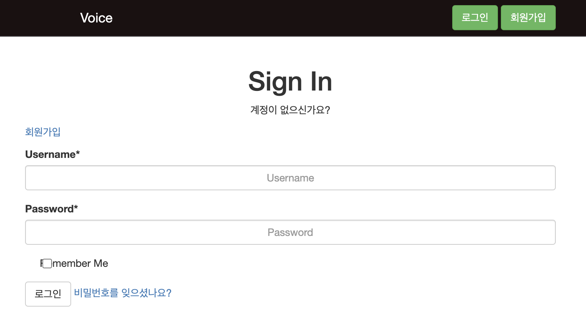
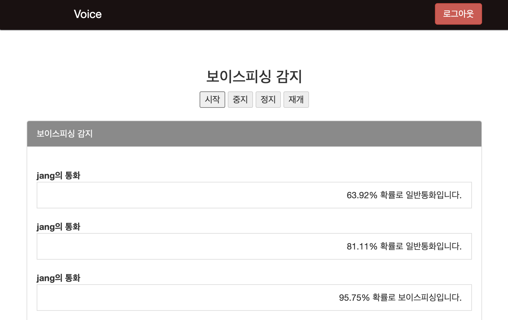

## NLP 기반 피싱 탐지 서비스📱⚠️
한국외국어대학교 데이터청년캠퍼스 딥러닝기반 자연어처리 과정 프로젝트

생태계교란조: 홍수빈, 백지헌, 장영재, 정희수, 이규영

2023 사이버보안 빅데이터 공모전 C트랙 (한국인터넷진흥원) 최우수상 수상작

---

## 1. 텍스트 분류 모델(스미싱)
### 파일 설명
- **main_script**: `test_classification_module` 모듈을 호출하여 실행하는 메인 파일.
- **test_classification_module.py**: 스미싱 감지 모델의 실제 기능이 구현된 모듈로, 모델과 데이터셋 경로 설정이 필요합니다.
- **AttBiLSTM_2K**: Bi-LSTM 모델 파일. (KoBERT와 KoELECTRA 모델 파일은 용량 문제로 포함되지 않았으나, 모델링 코드는 제공됩니다.)
- **integrated_unbalan5.csv**: 스미싱 탐지 모델에 사용되는 데이터셋 파일.

### 텍스트 분류 모델 설명
이 프로젝트는 스미싱 문자의 문맥을 깊이 이해하고 효과적으로 분류하기 위해 다양한 모델을 앙상블로 결합한 스미싱 감지 모델을 구현했습니다. 텍스트 분류에는 **Transformers 기반 모델**인 KoBERT와 KoELECTRA, 그리고 **Bi-LSTM** 모델이 활용됩니다. 각각의 모델은 다음과 같은 강점을 제공합니다.

1. **KoBERT**  
   - KoBERT는 양방향 문맥에서 단어를 마스킹한 후, 주변 맥락을 통해 감춰진 단어를 예측하는 방식으로 문장의 전반적인 의미를 학습합니다. 이 모델은 양방향에서 정보를 활용해 특정 단어가 문맥적으로 적합한지를 파악할 수 있어 스미싱 메시지에서 비정상적인 언어 구조나 은어 표현을 이해하는 데 효과적입니다.

2. **KoELECTRA**  
   - KoELECTRA는 일부 단어를 다른 단어로 대체한 후, 모델이 이를 원래 단어로 복원하는 방식으로 학습됩니다. 이 접근법은 문장 내 특정 단어의 적합성을 평가하는 능력을 강화하며, 일반화된 문장 구조뿐만 아니라 다양한 표현 방식의 비정상적인 텍스트에서도 높은 분류 성능을 발휘할 수 있습니다.

3. **Bi-LSTM with Attention and Mecab Tokenizer**  
   - Bi-LSTM은 문장의 양방향 문맥 정보를 동시에 반영할 수 있는 순환 신경망(RNN) 기반의 모델입니다. Mecab 토크나이저를 사용하여 한국어 문장을 미세하게 분해해, 스미싱 의도를 파악하는 데 최적화된 임베딩을 생성합니다. 특히, Mecab을 통해 한국어의 복잡한 언어적 특성을 고려함으로써 비정상적인 언어 패턴을 더 잘 탐지할 수 있습니다.
   - **Attention 메커니즘**을 추가해 중요한 단어에 집중할 수 있도록 설계함으로써, 은밀히 숨겨진 스미싱 의도나 범죄 가능성을 높은 효율로 감지합니다.

### 앙상블 접근
KoBERT와 KoELECTRA는 사전 학습된 언어 모델로, 일반화된 문맥 이해에 강점을 가지지만 특정 도메인에 대한 세밀한 최적화는 부족할 수 있습니다. 이를 보완하기 위해 **Bi-LSTM**과 **Mecab Tokenizer**를 적용한 모델을 추가하여 한국어 스미싱 문자를 도메인에 최적화된 형태로 처리할 수 있도록 하였습니다.  
각 모델의 앙상블은 스미싱 텍스트의 다양한 패턴을 폭넓게 감지할 수 있으며, 기존의 스미싱 범죄 패턴은 물론 새로운 유형이나 변형된 스미싱 시도에서도 높은 성능을 보입니다.

## 2. 음성 분류 모델(보이스피싱)
### 실시간 음성 STT 처리
Django Speech to text, Voise Phishing detecter
입력된 음성 파일을 실시간으로 STT 처리하여 변환한 결과를 KOBERT, BILSTM 모델로 보이스피싱인지 유무 검출

#### Commands to Setup the environment and run the server

> git clone https://github.com/urinaner/voice_phishing.git

> cd Django-Speech-to-text-Chat

> virtualenv venv

> source venv/bin/activate

> pip install -r requirements.txt

> python manage.py runserver

 

 

