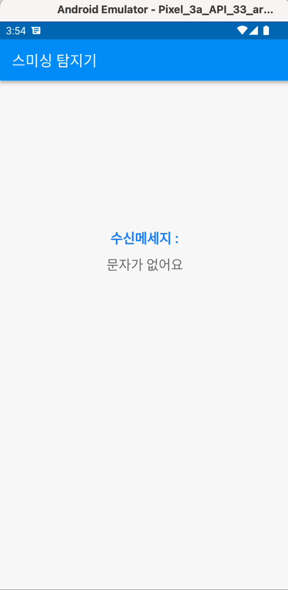
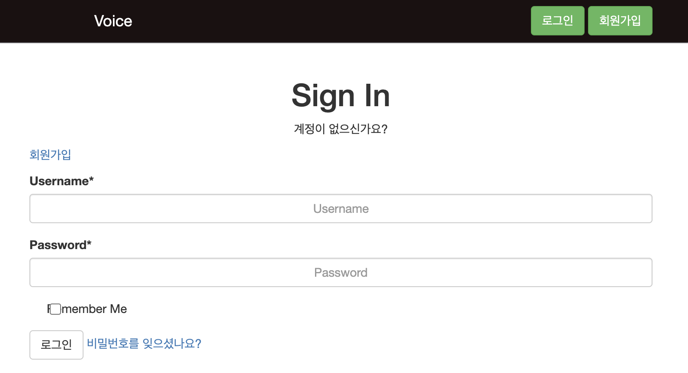
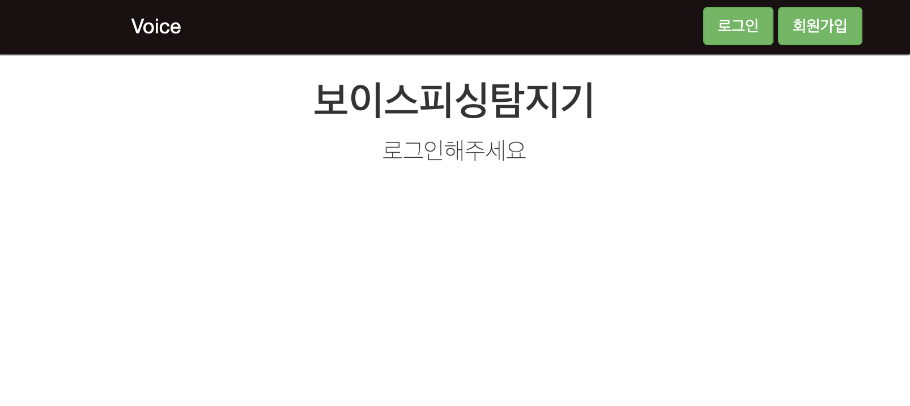
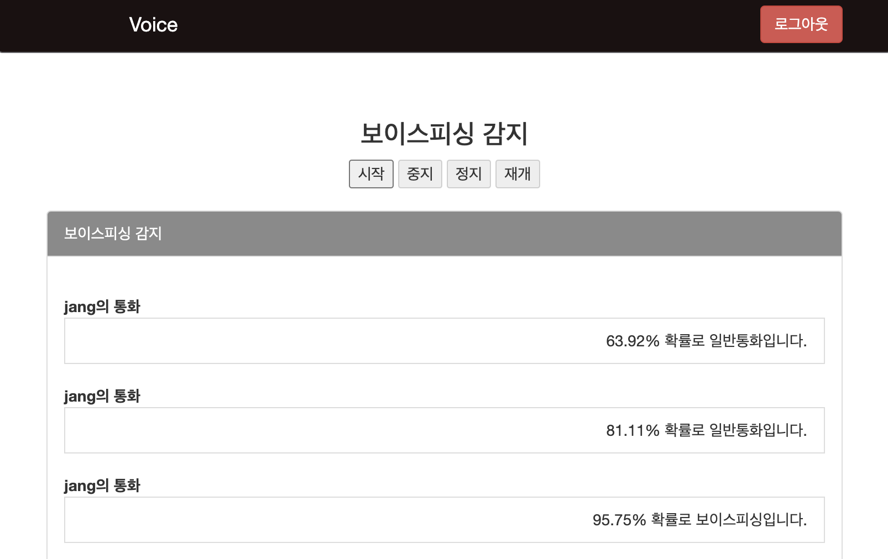

# 📱 AntiPhishingNLP — NLP-based Phishing Detection Service

**🌐 Available Versions:** [🇰🇷 한국어 (Korean)](/README_KR.md) | [🇯🇵 日本語 (Japanese)](/README_JP.md)

> 🏆 **2023 Korea Internet & Security Agency (KISA) Cybersecurity AI & Big Data Challenge, Track C — Grand Prize (1st Place)**  
> Team project from the Deep Learning-based NLP program at Hankuk University of Foreign Studies (HUFS) Data Youth Campus

> 📌 **Predecessor Project:** The jamo-level tokenization strategy, ensemble design, and community crawling pipeline built in [SepticFilterNLP](https://github.com/fairyofdata/SepticFilterNLP) (Samsung SDS Multicampus Grand Prize, 2022) directly formed the technical foundation of this project.

A dual-channel NLP-based phishing detection system that identifies both **smishing** (text-based phishing) and **voice phishing** simultaneously.  
The text channel (smishing) uses a **triple ensemble** of KoBERT + KoELECTRA + Att-BiLSTM (notebooks in `Phishing Detection/`). The voice channel is a separate Django demo: it transcribes speech with the Google Web Speech API and classifies the transcript with its own single LSTM model (`best_model.h5`), not with the ensemble.

---

## 🏗️ System Architecture

```
[Text channel — notebooks]
    📩 Smishing SMS (Text)
        → [Trinity Ensemble: KoBERT ┬ KoELECTRA ┬ Att-BiLSTM → Soft Voting]
        → Phishing / Normal

[Voice channel — Django demo]
    🎙️ Audio → Google Web Speech API (STT) → Text
        → [Single LSTM classifier: best_model.h5]
        → Voice-phishing probability
```


---

## 🔬 Model Details

### 1. KoBERT
- Korean BERT trained with MLM (Masked Language Modeling) for bidirectional contextual understanding
- Captures abnormal linguistic structures and slang patterns in smishing messages at a semantic level

### 2. KoELECTRA
- Korean ELECTRA using RTD (Replaced Token Detection) to assess token plausibility within sentences
- Demonstrates strong generalization on novel or mutated smishing patterns

### 3. Att-BiLSTM (Attention + Bidirectional LSTM + MeCab)
- MeCab morphological analyzer decomposes Korean compound words for precise embedding
- Attention mechanism focuses weight on key words that signal phishing intent
- Domain-specialized optimization compensates for under-detection by Transformer-based models

### Ensemble Strategy
Final decision made by **Soft Voting** across all three models.  
Combines the generalization ability of KoBERT & KoELECTRA with the domain-specific precision of Att-BiLSTM, enabling detection of both known phishing patterns and novel variations.

---

## 📊 Dataset

| Item | Detail |
|---|---|
| **Dataset** | `KorCCViD_v1.3_fullcleansed.csv` (Cleansed Korean Cybercrime Corpus) |
| **Class Imbalance** | SMOTE (Synthetic Minority Over-sampling Technique) applied |
| **Train/Val Split** | Stratified split accounting for class distribution |

---

## 🖥️ Service Components

| Channel | Technology | Description |
|---|---|---|
| Smishing Detection | Python, KoBERT, KoELECTRA, Att-BiLSTM | Text message classification pipeline |
| Voice Phishing Detection | Django, Web Speech API, STT | Real-time audio → text → classification |

### Voice Phishing Detection Demo







---

## 🚀 Getting Started

### Prerequisites
- Python 3.8+
- Django 3.x+

### Text Classification Module (Smishing)
```bash
pip install -r requirements.txt
python main_script.py
```
> ⚠️ KoBERT & KoELECTRA model weights are excluded due to file size constraints. Modeling notebooks (`.ipynb`) are available in the `Phishing Detection/` directory.

### Voice Phishing Detection Server (Django)
```bash
python manage.py runserver
```
Access `http://localhost:8000` in your browser and speak into your microphone to see real-time phishing detection results.

---

## 📁 Key Files

| File / Folder | Description |
|---|---|
| `Phishing Detection/` | Model training notebooks (KoBERT, KoELECTRA, Att-BiLSTM, Ensemble) |
| `best_model.h5` | Trained LSTM model weights for the voice demo (Embedding → LSTM → Dense) |
| `KorCCViD_v1.3_fullcleansed.csv` | Cleansed smishing training dataset |
| `text_classification_module.py` | Smishing classification inference module |
| `chat/` | Django voice phishing detection app (views, models, urls) |

---

## 👥 Team & Contributions

**Team Name**: 생태계교란조 (Ecosystem Disruptors), HUFS Data Youth Campus  
**Members**: Subin Hong, **Jiheon Baek**, Youngjae Jang, Heesu Jeong, Gyuyoung Lee

**Jiheon Baek's Contributions**:
- Proposed the Att-BiLSTM design (a bidirectional LSTM with an attention layer, in place of a plain LSTM) and led its implementation
- Designed the soft-voting strategy for the ensemble
- Proposed SMOTE oversampling for the class imbalance and led its implementation
- Developed the text classification inference module (`text_classification_module.py`)
- Some of the detailed work was done jointly with teammates

---

## 📄 License

MIT License
