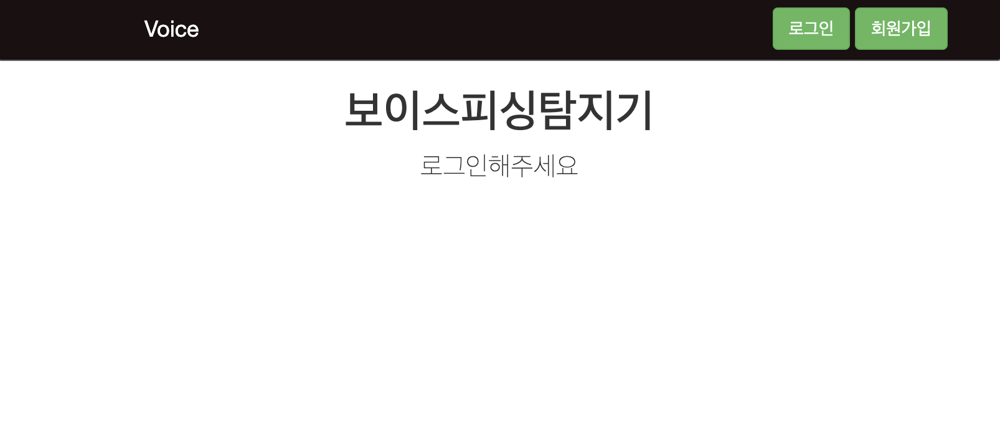

## NLP 기반 피싱 탐지 서비스
한국외국어대학교 데이터청년캠퍼스 딥러닝기반 자연어처리 과정 프로젝트

생태계교란조: 홍수빈, 백지헌, 장영재, 정희수, 이규영

### 텍스트 분류

#### 파일 설명
1. main_scirpt:  test_classification_module모듈을 불러와 실행하는 파일.
2. test_classification_module.py: 실제 기능 구현된 모듈. 모델과 데이터셋 경로 설정 필요.
3. AttBiLSTM_2K: 모델 파일. (KoBERT와 KoELECTRA는 용량 문제로 생략하였으나, 모델링 코드는 포함되어 있음)
4. intergrated_unbalan5.csv: 데이터셋 파일.

#### 모델 설명
1. KoBERT - 양방향 문맥에서 단어를 마스킹하여 전체 맥락 파악
2. KoELECTRA - 문맥 상 단어의 적합도를 고려한 세밀한 맥락 이해
3. Bi-LSTM (with Attention layer and Mecab Tokenizer) - 스미싱(도메인) 최적화 임베딩 모델 

  텍스트 분류 모델은 스미싱 문자의 맥락 파악에 효과적인 Transformers 기반 모델인 KoBERT와 KoELECTRA 그리고 직접 임베딩한 Bi-LSTM으로 구성하였습니다. 먼저 KoBERT는 임의의 단어를 감추고 Pre-train된 모델이 양방향 문맥을 모두 고려하여 해당 단어를 맞춤으로써 마스킹 된 단어의 의미를 파악합니다. 한편 KoELECTRA는 훈련 데이터에서 일부 단어를 다른 단어로 바꾼 후, 모델이 이를 원래 단어로 복원하도록 학습합니다.  정리하면, KoBERT는 빈 위치에 올바른 단어를 예측하는 데 초점을 맞추고, KoELECTRA는 주어진 문맥에서의 단어의 적합성을 평가합니다. 두 모델이 서로 다른 방식으로 문맥을 파악하고 예측하는 과정을 통해 스미싱 메시지에서 은어나 비정상적인 문장 구조를 사용하는 경우에도 이를 높은 정확도로 판별할 수 있습니다. 하지만 두 모델이 모두 사전 학습된 임베딩을 사용하는 일반화된 모델이라는 한계가 있습니다. 이를 보완하고자 스미싱 의도 파악이라는 도메인에 최적화하고, 문맥 이해의 편향성을 개선하고자 Mecab을 Bi-LSTM의 토크나이저로 적용하여 함께 앙상블합니다. 또한 한국어의 미묘한 언어적 특성을 고려하여 문장을 세밀하게 분해할 수 있는Mecab을 양방향 LSTM에 적용하면 스미싱 범죄의 은근한 의도를 파악하는데 더욱 효과적입니다. 여기에 Attention 매커니즘을 추가하여 숨겨진 범죄 가능성을 보다 효율적으로 파악할 수 있습니다. 이와 같이 각 모델의 장점을 결합하고 단점이 상쇄된 앙상블 모델은 데이터의 여러 측면을 탐지할 수 있게 됨으로써, 기존의 스미싱 범죄 패턴은 물론 예측하기 어려운 새로운 유형이나 파생된 형태의 스미싱 범죄 시도 탐지에서도 높은 성능을 발휘할 수 있습니다.

### 음성 분류 
Django Speech to text, Voise Phishing detecter
입력된 음성 파일을 실시간으로 STT 처리하여 변환한 결과를 KOBERT, BILSTM 모델로 보이스피싱인지 유무 검출

#### Commands to Setup the environment and run the server

> git clone https://github.com/urinaner/voice_phishing.git

> cd Django-Speech-to-text-Chat

> virtualenv venv

> source venv/bin/activate

> pip install -r requirements.txt

> python manage.py runserver

 

 

